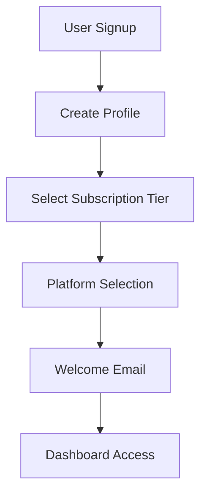
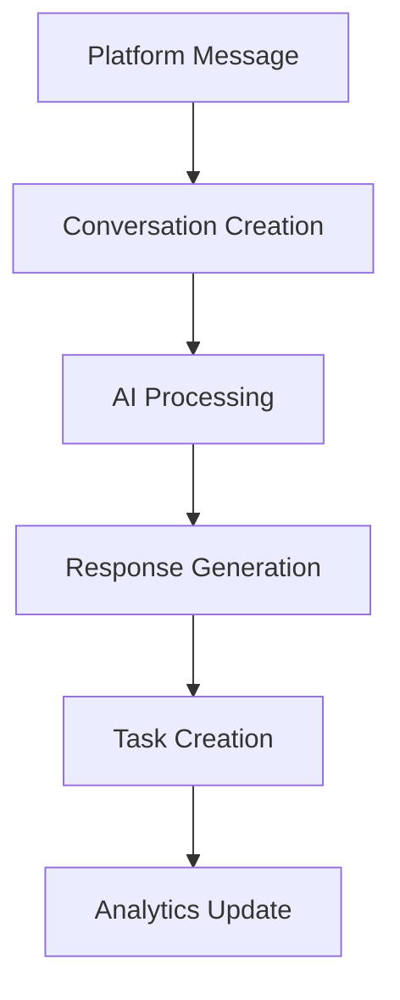
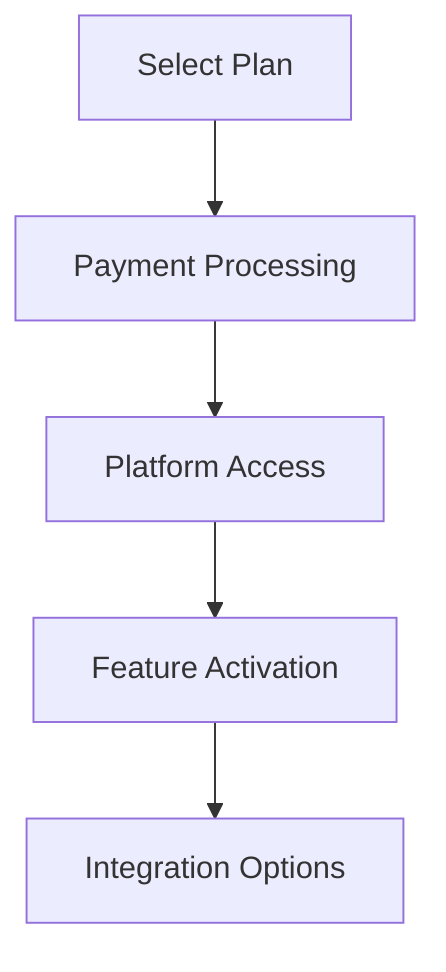

# Dana AI Documentation

## Overview

Dana AI is a comprehensive social media management platform that uses AI to automate customer interactions across Facebook, Instagram, and WhatsApp. The platform provides real-time responses, analytics, task management, and subscription-based access to different platform combinations.

## System Architecture

### Core Components

1. **Authentication System**
   - Email/password authentication via Supabase Auth
   - Profile creation on signup
   - Subscription tier selection during onboarding
   - Welcome email notification system

2. **Dashboard**
   - Real-time metrics display
   - Platform-specific analytics
   - Visual representation of customer interactions
   - Color-coded platform indicators based on subscription status

3. **Subscription Management**
   - Tiered pricing model
   - Platform combination options:
     - Facebook + Instagram ($49.99)
     - Facebook + WhatsApp ($49.99)
     - Instagram + WhatsApp ($49.99)
     - Complete Package ($79.99)
   - Subscription status tracking
   - Upgrade/downgrade capabilities

4. **Integration Hub**
   - CRM Systems:
     - Salesforce
     - HubSpot
   - Communication:
     - Slack
   - Analytics:
     - Google Analytics
   - E-commerce:
     - Shopify
   - Helpdesk:
     - Zendesk

## Database Schema

### Core Tables

1. **profiles**
   ```sql
   id uuid PK
   email text UNIQUE
   company text
   account_setup_complete boolean
   welcome_email_sent boolean
   subscription_tier_id uuid FK
   onboarding_completed boolean
   created_at timestamptz
   updated_at timestamptz
   ```

2. **subscription_tiers**
   ```sql
   id uuid PK
   name text UNIQUE
   description text
   price numeric(10,2)
   features jsonb
   platforms text[]
   created_at timestamptz
   updated_at timestamptz
   ```

3. **user_subscriptions**
   ```sql
   id uuid PK
   user_id uuid FK
   subscription_tier_id uuid FK
   status text
   start_date timestamptz
   end_date timestamptz
   payment_status text
   last_payment_date timestamptz
   next_payment_date timestamptz
   created_at timestamptz
   updated_at timestamptz
   ```

### Communication Tables

4. **conversations**
   ```sql
   id uuid PK
   user_id uuid FK
   platform text
   client_name text
   client_company text
   created_at timestamptz
   updated_at timestamptz
   ```

5. **messages**
   ```sql
   id uuid PK
   conversation_id uuid FK
   content text
   sender_type text
   created_at timestamptz
   ```

6. **responses**
   ```sql
   id uuid PK
   content text
   platform text
   user_id uuid FK
   created_at timestamptz
   updated_at timestamptz
   ```

### Management Tables

7. **tasks**
   ```sql
   id uuid PK
   description text
   status text
   platform text
   client_name text
   client_company text
   user_id uuid FK
   created_at timestamptz
   updated_at timestamptz
   ```

8. **interactions**
   ```sql
   id uuid PK
   platform text
   client_name text
   client_company text
   user_id uuid FK
   created_at timestamptz
   updated_at timestamptz
   ```

9. **knowledge_files**
   ```sql
   id uuid PK
   user_id uuid FK
   file_name text
   file_size integer
   file_type text
   content bytea
   created_at timestamptz
   updated_at timestamptz
   ```

10. **admin_users**
    ```sql
    id uuid PK
    user_id uuid FK
    role text
    created_at timestamptz
    updated_at timestamptz
    ```

## System Flow

### 1. User Onboarding


### 2. Message Processing


### 3. Subscription Management


## Key Features

### 1. Dashboard Analytics
- Real-time metrics display
- Platform-specific statistics
- Color-coded platform indicators
- Task management overview
- Interaction tracking

### 2. Conversation Management
- Multi-platform messaging
- AI-powered responses
- Context-aware interactions
- Task automation
- Client history tracking

### 3. Integration System
- CRM connections (Salesforce, HubSpot)
- Communication tools (Slack)
- Analytics platforms (Google Analytics)
- E-commerce integration (Shopify)
- Support systems (Zendesk)

### 4. Subscription System
- Flexible platform combinations
- Tiered pricing model
- Feature-based access control
- Upgrade/downgrade capabilities
- Usage tracking

## Security

### Authentication
- Email/password authentication
- Session management
- Token-based access
- Secure password reset

### Row Level Security (RLS)
- User data isolation
- Platform access control
- Subscription-based restrictions
- Admin access management

### Admin Controls
- User management
- Subscription oversight
- System monitoring
- Support access

## Platform Integration

### Facebook
- Messenger API integration
- Page management
- Automated responses
- Analytics tracking

### Instagram
- Direct message handling
- Business account integration
- Automated engagement
- Metrics collection

### WhatsApp
- Business API integration
- Automated messaging
- Contact management
- Response tracking

## Development Guidelines

### Code Organization
```
src/
├── components/
│   ├── auth/
│   ├── dashboard/
│   ├── integrations/
│   └── subscription/
├── hooks/
├── services/
├── types/
└── utils/
```

### State Management
- React Query for server state
- React Context for global state
- Local state for component data
- Real-time updates via Supabase

### Styling
- Tailwind CSS for styling
- Lucide React for icons
- Responsive design patterns
- Platform-specific theming

## Deployment

### Production Build
```bash
npm run build
```

### Environment Variables
```
VITE_SUPABASE_URL=your_supabase_url
VITE_SUPABASE_ANON_KEY=your_supabase_anon_key
VITE_SENTRY_DSN=your_sentry_dsn
VITE_SENTRY_ENVIRONMENT=production
```

### Deployment Process
1. Build verification
2. Environment configuration
3. Asset optimization
4. CDN distribution
5. SSL/TLS setup

## Monitoring

### Error Tracking
- Sentry integration
- Error boundaries
- Console logging
- Performance monitoring

### Analytics
- User engagement metrics
- Platform usage statistics
- Response time tracking
- Task completion rates

### Performance
- Web vitals monitoring
- Load time optimization
- Resource utilization
- Cache management

## Support

### Technical Support
- Documentation access
- Email support
- Priority handling
- Integration assistance

### User Support
- Platform guidance
- Feature tutorials
- Subscription help
- Integration support

## Maintenance

### Regular Tasks
- Database backups
- Performance monitoring
- Security updates
- Feature updates

### System Updates
- Version control
- Dependency management
- Security patches
- Feature deployment

## Contact

For technical support or feature requests:
1. Email: support@hartford-tech.com
2. Documentation: https://docs.hartford-tech.com
3. API Reference: https://api.hartford-tech.com